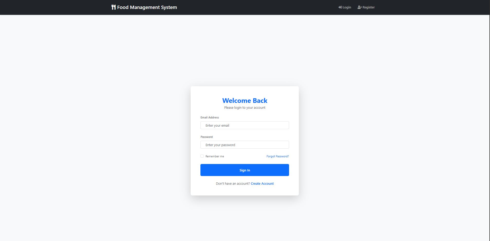
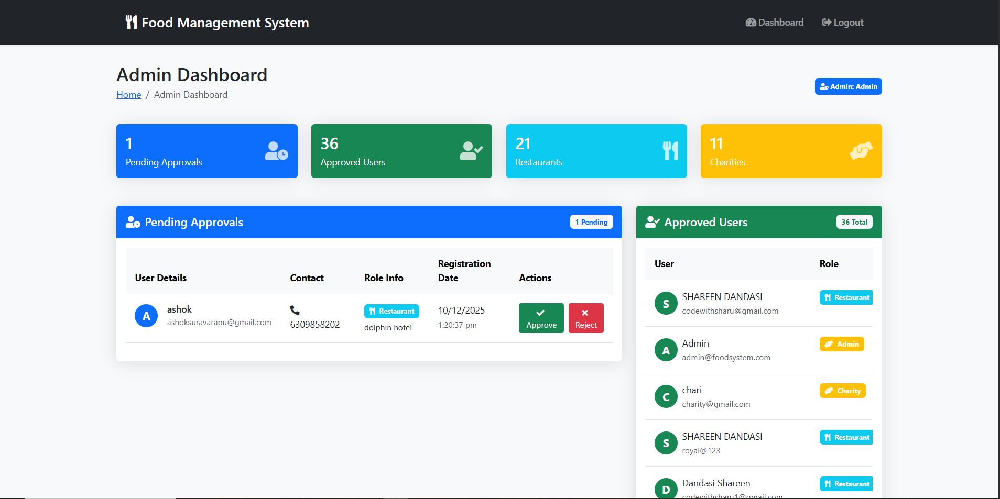
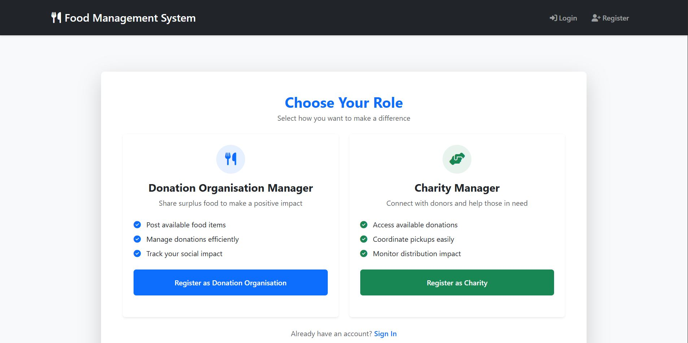
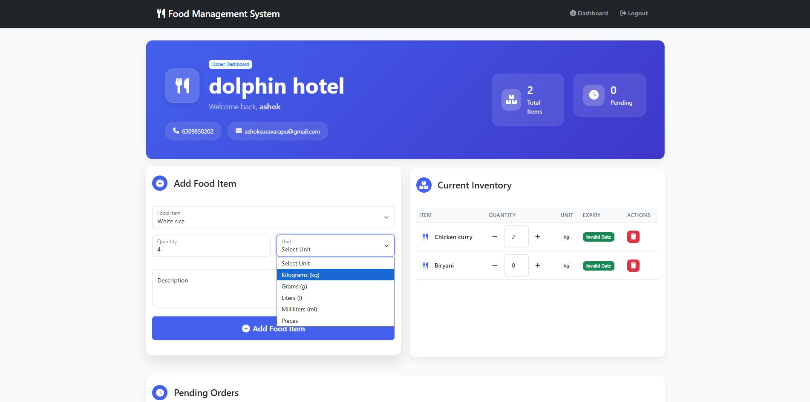
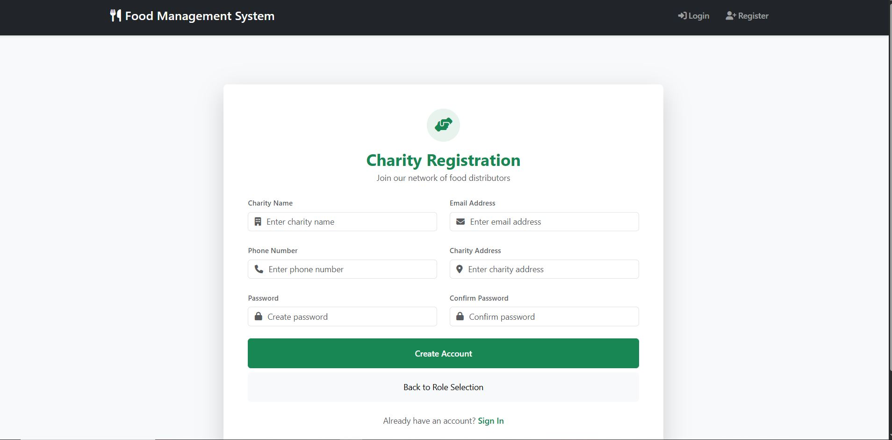

# 🚀 Smart Food Waste Management System
A Blockchain-Integrated Platform to Reduce Food Waste & Support Charities

This is a full-stack web application that connects restaurants, charities, and admins to redistribute surplus food efficiently.

The system uses:

Blockchain for transparency

Node.js + Express backend

MongoDB database

EJS templating for the frontend

Each donation is saved as a block, ensuring traceability and trust.

## ⭐ Features
### 👨‍🍳 For Restaurants

Register & login securely

Add surplus food

Update or delete food listings

Track donation history

View blockchain logs of donated food

### 🏥 For Charities / NGOs

Register & login

View available food

Request food donations

Track request history

Transparent donation history powered by blockchain

### 🛡️ For Admin

Approve or reject registration requests

Manage all users

Monitor food distributions

View full blockchain ledger

## 🧱 Tech Stack
Layer	Technologies
Frontend	HTML, CSS, EJS
Backend	Node.js, Express.js
Database	MongoDB, Mongoose
Authentication	Passport.js, bcrypt
Blockchain	Custom JavaScript blockchain
Session	express-session
## 📂 Project Structure
Smart-food-waste-management-system/
│
├── config/             
├── middleware/         
├── models/             
├── public/             
├── routes/             
├── views/              
│
├── app.js              
├── blockchain.js       
├── base.txt            
├── package.json        
└── README.md           

## ⚙️ Installation
1️⃣ Clone Repository
git clone https://github.com/ashoksuravarapu31/smart-food-waste-management-system.git

2️⃣ Install Dependencies
npm install

3️⃣ Create .env File
MONGO_URI=your_mongodb_url
SESSION_SECRET=your_secret
PORT=3000

4️⃣ Start Server
npm start

5️⃣ Open in Browser
http://localhost:3000

## 🔗 Blockchain Workflow
Restaurant Donates Food
        ↓
System Creates a New Block
        ↓
Block Contains:
 - Food ID
 - Donor ID
 - Charity ID
 - Timestamp
 - Previous Hash
 - Current Hash
        ↓
Block Added to Chain → Immutable Record

## 🚀 Future Enhancements

Email/SMS notifications

Real-time food tracking

AI-based food spoilage detection

Mobile app

Location-based donation matching

## 👨‍💻 Developed By
**Ashok Suravarapu**  
BCA Graduate (Fresher)  
Aspiring Full-Stack / Backend Developer

## 📄 License

MIT License

---

# 📸 Screenshots  
Below are the key UI pages of the **Smart Food Waste Management System**.

---
## 🏠 Home Page (Hero Section)  

---

## 🔐 Login Page  

---

## 🧑‍💼 Admin Dashboard  

---

## 🧾 Admin – Approvals  

---

## 🎭 Role Selection  

---

## Donor Registration 

---

## 🍽️ Donor (Restaurant) Dashboard  

---

## ➕ Add Food Item  

---

## Charity Registration 

---

## 🧍 Charity Dashboard  

---

## 🛒 Charity Food Request Page  

---

## ⏳ Pending status for approval from admin after registering for Donor and Charity profiles

---
